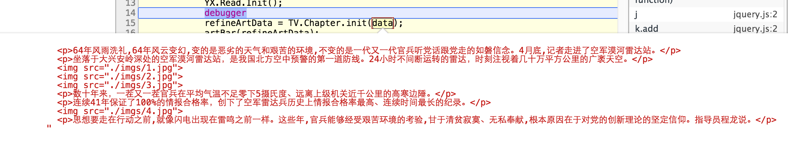
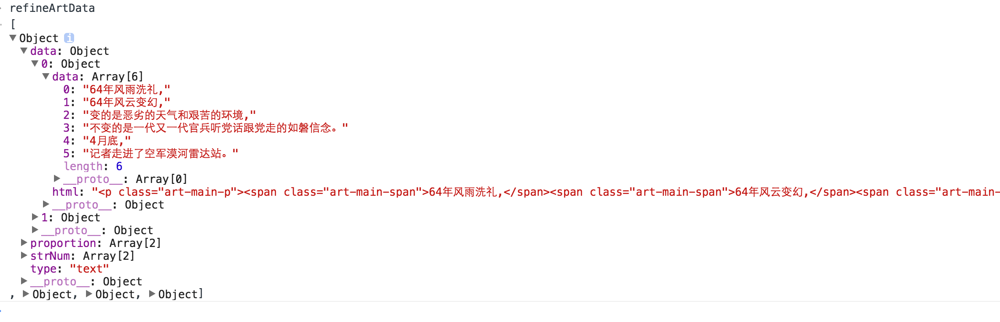

Chapter.js
---------
> 正文数据处理插件，提供一套算法，将html正文数据，处理成前端可用的数据格式


Chapter.js的正确使用方式
======================

- 将chapter.js引入index文件中

- 直接使用init方法，传入需要处理的数据
	
	```
	var refineArtData = TV.Chapter.init(data);
	```

- 被转换及转换后的数据格式如下
	


